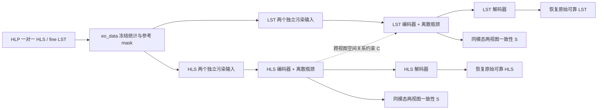

# Cross-View Discrete Tokenization for Noise-Robust Earth Observation

> 2026-09-14 划分完成：HLP v2 已建立218,975对训练、11,684对独立验证、11,757对固定测试。新读取须指定 `prepared="processed_data/hlp_split_v2_20260914"`，并使用新训练统计。见[成员、规则和读取方式](../data_inspection/hlp_split_20260914/README.md)。下文“无独立验证”指旧v1及历史实验；已有训练配置尚未自动切换，新实验须接入v2并重新训练。

2026-09-14 数据术语同步：HLP = HLS-LST-Pairs，HLC = HLS-LST-CrossSensor。依据[数据集文档](../data_inspection/FINAL_DATASET_SUMMARY.md)，HLP 源 `val` 对应测试集，仍保留旧 API/配置/日志标签；无独立验证集。以下 `val` 形状库、评价子集、`data.val_limit` 和 best checkpoint 机制描述既有实现，不能作为新实验使用测试集调参的许可。后续训练须从训练 tiles 建立独立验证划分并接入验证/选模流程。本次只同步说明，训练实现和历史运行保持原状。模型名 Prithvi-EO-2.0 保留。

论文一的可运行实验框架。用户已确认主数据为 **HLS-LST-Pairs（HLP）的一张 HLS 对应一张 fine LST**，每对沿用同一 record ID 与既有 train/val 划分。HLC 月份数据独立保留，v1 框架不会混入它，也不读取 MODIS coarse LST。

这份说明和配置文件是当前实现入口；较早研究计划中以 HLC 月份展开为主的段落是历史方案。完整模型效果尚待 pilot；框架验收只使用短训练，不作为论文结果。

已完成的首轮消融见 [结果与对照图](../runs/paper1/ablation_vq_prithvi_20260910/report/RESULTS.md) 和 [VQ-VAE / 无时间 Prithvi 协议](../experiments/paper1/ablation_vq_prithvi/PROTOCOL.md)：用户要求只使用 Prithvi-EO-2.0 网络结构、无需 300M 参数。本轮 `prithvi_eo2_spatial` 复用官方 encoder/decoder Block，移除时间、缩小为约 9M 参数，与卷积 VQ-VAE 的同模态参数量相差不到 4%，且均低于 VAR VQ-VAE 的约 109M 参数上限。每模态分别做干净/加噪训练，共 8 组，均从零初始化，已完成各 1,000 步 pilot。本轮不使用较早的 `prithvi_style` 小型近似实现。

## 数据与方法



- HLS `[6,256,256]`、fine LST `[1,256,256]`，直接复用 `eo_data` 的四组冻结统计。本篇使用 HLP 的两组；所有模型共用同一份统计。
- 两种模态以源 record ID 连接，不按两个 loader 的行号盲配；只取所需模态的共同有效样本。当前完整索引包含 train 230,659 对、val 11,757 对。
- HLS 六波段与 LST 各有独立编码器/解码器。训练时的 C 项连接两个量化表示；推理时每个 codec 独立工作，不把另一模态的完整特征偷偷传给 decoder。
- 每个样本、每种模态产生两个污染视图。输入在编码前处理，模型只接收污染图和 `input_mask`；干净图只用于参考损失。所有消融都保留两视图与 projection head。
- 原始 `reference_mask`、模型 `input_mask`、人工 `corruption_mask` 分开。遮挡区有参考时参与损失；原本无参考的区域不进入监督/物理误差分母。
- 全量核对中，train 183,613/230,659 对（79.60%）、val 8,770/11,757 对（74.59%）的 HLS 来源 tile/时间字段均一致。默认 C 项只用于这些配对，其余样本继续参与本模态重建。日志记录 C 可用数量；这个元数据筛查不代表已经证明逐像元配准或严格同期。见 [全量配对审计](../experiments/paper1/paired_metadata_audit.json)。
- LST 存储值为摄氏度 × 100。训练仍在冻结 z-score 空间，物理输出 `ds.denormalize(image)/100`；物理误差用冻结 std/100 恢复。HLS 评价单位为反射率。

## 已实现的对照

| 配置 | 模型 | S | C | 默认输入 |
|---|---|---:|---:|---|
| `prithvi_ae00` | 双模态独立连续 AE | 0 | 0 | QA 形状缺失 |
| `prithvi_fsq00` | 双模态独立 FSQ | 0 | 0 | QA 形状缺失 |
| `prithvi_vq00` | 双模态独立 VQ | 0 | 0 | QA 形状缺失 |
| `prithvi_vq10` | VQ + 污染视图一致性 | 0.1 | 0 | QA 形状缺失 |
| `prithvi_vq01` | VQ + 跨视图结构项 | 0 | 0.1 | QA 形状缺失 |
| `prithvi_vq11` | VQ + 两项约束 | 0.1 | 0.1 | QA 形状缺失 |
| `prithvi_{hls,lst}_conv_vae_clean` | 两个单模态卷积 VAE | 0 | 0 | 干净自重建 |
| `prithvi_{hls,lst}_prithvi_style_vae_clean` | 两个单模态 Prithvi 风格 VAE | 0 | 0 | 干净自重建 |

配置文件在 [experiments/paper1/configs](../experiments/paper1/configs)。VQ00/10/01/11 保持相同网络、种子、样本流、两视图、码率与训练预算，只有 loss 权重不同。日志中的 S/C 是未加权原值，权重为 0 时仍可有诊断数值。

默认卷积 backbone 为 base width 64、每层 2 个 ResBlock、四次下采样、GroupNorm/SiLU；latent 为 32 通道，默认 16×16。低/中/高码率网格 8/16/32 通过同样的整数平均池化/重复上采样切换，保持可确定的 CUDA 反向路径。无 encoder-decoder 跳接绕过瓶颈，无输出 sigmoid 或额外 clipping。

VQ 使用梯度更新的独立码本，K=512、commitment=0.25；没有混用 EMA。FSQ 使用 `[8,8,8]` 三维标量量化、512 个组合码，并保留 32 通道到 3 维的投影差异。两者都支持 indices → latent → 图像的实际解码。

Prithvi 风格 VAE 为本项目从零训练的适配：`(1,16,16)` 三维 patch embedding、T=1、可分离三维 sin/cos 位置编码、Transformer 编解码器及变分瓶颈。**它不是官方预训练 Prithvi，也不是对官方模型的精确复现**；未注入时间/位置元数据，未增加 MAE 随机 mask。设计来源见 [NASA/IBM Prithvi 架构说明](https://github.com/NASA-IMPACT/Prithvi-EO-2.0)。

## 损失与噪声

主目标为有效像元的样本等权 MSE + 0.1×梯度 MSE + 瓶颈损失；VAE KL 系数默认 1e-4。空间差分只比较两端都有效的位置，空监督项返回零。所有重建损失在 float32 中计算，模型可使用 BF16。

S 对 VQ 使用两视图软码分配的对称 JS；距离按 latent 维数归一化，温度默认 1。连续/FSQ 的 S 接口使用量化或连续 latent 的 MSE，不能将其当作同一个分配机制。只对两个输入共同可见覆盖≥75%的 token 单元施加 S。

C 将量化后的投影特征按共同参考 mask 加权池化到 4×4，比较单元间 cosine 关系矩阵，排除对角项；仅用共同参考覆盖≥75%的单元以及元数据筛查通过的配对。它不要求两模态像素相同或离散码号相同。该项的有效性、新颖性和抗坍缩表现仍待消融验证。

主噪声为从源 Fmask 的 cloud/shadow/adjacency 三类分别提取的连通形状，排除 fill=255；训练和验证形状库分开，记录 split、record ID、来源 key、类别、原始记录 hash 和形状 hash。在线旋转/缩放/移植到有效参考区域，输出实际达到的遮挡比例。将 HLS QA 形状移植到 LST 仅代表合成几何，不表示原 LST 的真实云位置。

默认覆盖率 5%/10%/20%，每个训练视图有 25% 概率保持干净；验证默认 10%、固定两个 realization。支持显式 `procedural_missing`，它标注为程序生成形状；Gaussian/stripes 仅为数值诊断。不会在没有形状库时静默降级。当前是 **R1 有参考、已知输入 mask 的缺失恢复**，不等同于未识别污染的真实去云。

噪声由稳定 SHA-256 种子控制，模型名和 loss 权重不进入种子。训练 epoch 通过 sampler 的索引元组传入 worker，验证不随 epoch 变化。不同训练种子不改变预先选定的数据子集。

## 既有框架复现入口

在项目根目录，Windows 使用：

```powershell
.\setup_paper1.ps1
.\.venv-paper1\Scripts\python.exe -m eo_denoise inspect --config experiments/paper1/configs/prithvi_vq11.json
.\run_paper1.ps1 -Mode smoke
```

当前工作区已经建立 train/val 形状库。首次迁移而没有形状库时运行：

```powershell
.\.venv-paper1\Scripts\python.exe -m eo_denoise bank --split train --scan 4096 --shapes 256
.\.venv-paper1\Scripts\python.exe -m eo_denoise bank --split val --scan 2048 --shapes 128
```

形状库拒绝覆盖已有文件；调整方案时选新的 `--output`，并在 config 中指向该目录。生成时读取的是压缩记录，不需要恢复原始数据树，也不生成整套加噪数据。

`smoke` 使用固定的 16 个 train、8 个 val 小子集，默认 4 个优化步，保留配置中的实际模型尺寸。它会验证反向传播、评价、checkpoint；结果目录明确标注 `framework_smoke`。

历史 pilot 的启动命令（正式新实验须先从训练 tiles 建立独立验证划分并接入训练器）：

```powershell
.\run_paper1.ps1 -Mode train -Config experiments/paper1/configs/prithvi_vq11.json -Output runs/paper1/vq11_seed17
```

默认 pilot 为 20,000 个 optimizer step，microbatch=2，累积 32 次，有效 batch 约为 64 对；遇到 epoch 尾批时按真实样本数加权。学习率 AdamW 1e-4，warmup 1000，余下 cosine 到 0.1×；使用全部 train，固定 256 个 val 子集，尚不是完整 val 结果。正式 full-val 将 config 中 `data.val_limit` 设为 null 并在训练开始前冻结；此处 full-val 实际覆盖 HLP 测试成员，成本另记。单模态 VAE 配置可单独运行，不能把短训分数当成模型优劣。

## 恢复、评价和导出

```powershell
# 必须使用对应运行保存的完整配置。
.\.venv-paper1\Scripts\python.exe -m eo_denoise train --config runs/paper1/vq11_seed17/config.json --output runs/paper1/vq11_seed17 --resume runs/paper1/vq11_seed17/last.pt

# 固定 checkpoint 的零噪声、10% 或其他覆盖率评价（源 val 为 HLP 测试成员）。
.\.venv-paper1\Scripts\python.exe -m eo_denoise evaluate --checkpoint runs/paper1/vq11_seed17/best.pt --coverage 0 --output runs/paper1/vq11_seed17/eval_clean
.\.venv-paper1\Scripts\python.exe -m eo_denoise evaluate --checkpoint runs/paper1/vq11_seed17/best.pt --coverage 0.1 --output runs/paper1/vq11_seed17/eval_10pct

# 导出一个样本的离散码，验证容器与 decoder 往返。
.\.venv-paper1\Scripts\python.exe -m eo_denoise export-tokens --checkpoint runs/paper1/vq11_seed17/best.pt --modality lst --index 0 --output runs/paper1/vq11_seed17/example.cvdt
```

`--stop-after` 是在指定绝对 optimizer step 完成 checkpoint 后停止，用于受控中断验证。配置、数据/统计/形状库指纹及处理代码不匹配时拒绝恢复。checkpoint 保存 optimizer、step、epoch、已消费样本位置、CPU/CUDA 随机状态；worker 的预取样本不会被误当作已经训练过。

独立架构消融可设 `data.train_views=1`，但 S 项必须为零；原双视图配置默认仍为 2。评价可显式传 `--noise-kind bank_missing`，使干净训练的模型也接受同一噪声测试，结果会同时记录训练噪声类型和评价覆盖率。所有物理预处理与归一化保持冻结。

每个运行保存 config、环境、参数量、码率约定、实际子集 record IDs、源代码快照、数据指纹、逐步日志、last/best checkpoint。每次验证保存 JSON 汇总、逐样本/视图/区域 JSONL，以及一个含输入、目标、预测和 mask 的 NumPy 预览。

评价分别报告人工污染区、保留区、全部参考区的 normalized RMSE、物理 RMSE/MAE/bias、逐波段误差和梯度误差；HLS 另有光谱角和 NDVI。先在样本内平均可用 realization，再按样本等权汇总，tile-cluster bootstrap 给出 RMSE 区间。零向量/零分母不进入 SAM/NDVI 的相应分母。best checkpoint 使用预定的区域 nRMSE，token 稳定性不是选择分数。

离散码另报告使用率、经验熵、perplexity、同模型两视图的 token flip rate。固定码率是 token payload；`.cvdt` 的实际总字节包括输入 mask、header、checksum，共享模型权重另计。例如 K512、16×16 的 token 本身为 288 字节，完整文件通常因 mask 而明显更大，不能只报 token 字节称为整个文件压缩率。当前使用可逆固定 bit 打包，**还没有实现 train-only 熵编码器**。

## 范围与后续

2026-09-10 验收已完成：19 项测试通过；真实 HLP 数据上 VQ11、FSQ、AE 及 HLS/LST 的两类 VAE 共 7 个配置在 RTX 5090 完成 2–4 步短训。VQ11 从第 2 步恢复到第 4 步；CPU VAE 测试验证中断/连续训练最终权重逐项精确一致。VQ/FSQ 实际文件导出后 decoder 往返最大误差均为 0。VQ00/10/01/11 的初始模型、完整配对索引和首个污染输入 hash 完全一致。验收记录见 [framework_validation.json](../experiments/paper1/framework_validation.json)，可用 `python experiments/paper1/validate_framework.py` 在已完成运行上重新核对。

HLP 源 train/val 分别为训练/测试，无独立验证集。旧输出中的 val/validation 标签须按测试成员解释；若曾用这些成员监测或选择模型，历史分数不能仅凭改名宣称为未参与开发的独立测试结果。下一步先完成 AE/VAE 保真与 VQ/FSQ pilot，再开展 VQ00/10/01/11 和错配消融。真实云下准确率、conditional decoder fusion、shared/private 多码本、多尺度残差 VQ、预训练 Prithvi 权重加载、真正的熵编码、完整物理指标/时空分层和多卡 DDP 尚不属于本次已完成内容。

方法参考：[VQ-VAE](https://arxiv.org/abs/1711.00937)、[FSQ](https://arxiv.org/abs/2309.15505)、[Prithvi-EO-2.0](https://github.com/NASA-IMPACT/Prithvi-EO-2.0)。冻结数据约定见 [统一数据协议](../experiments/data/UNIFIED_DATA_PROTOCOL.md)，摄氏度证据见 [LST 编码核验](../experiments/data/LST_ENCODING_VERIFICATION.md)。

```powershell
.\.venv-paper1\Scripts\python.exe -m pytest tests/test_eo_denoise.py tests/test_eo_data.py -q
```
