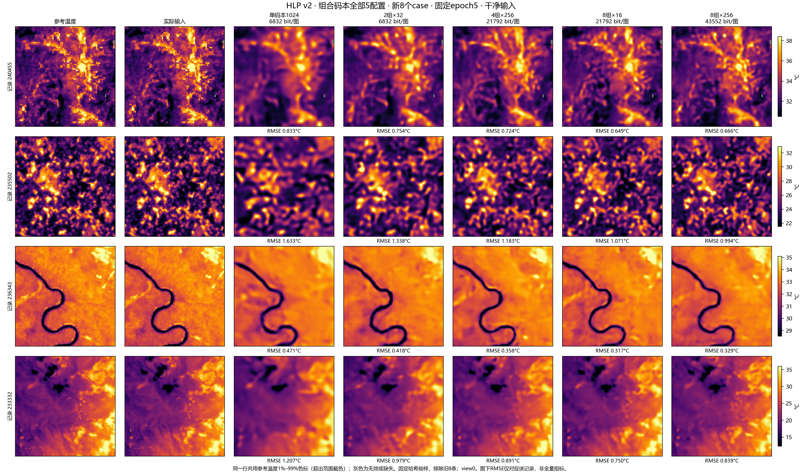
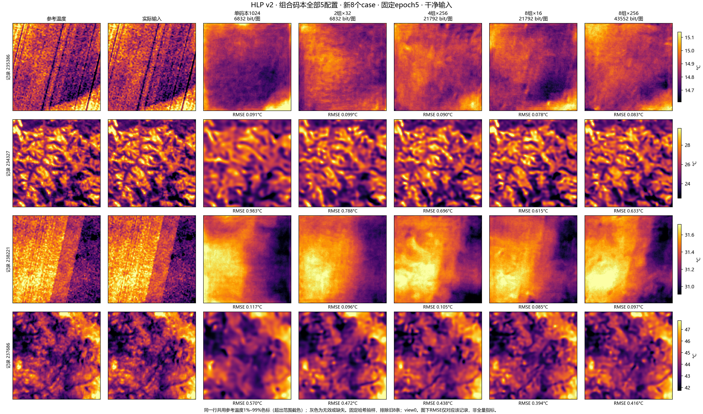
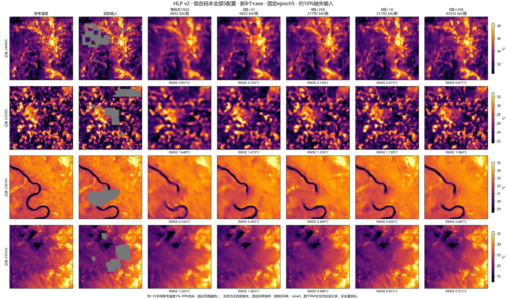
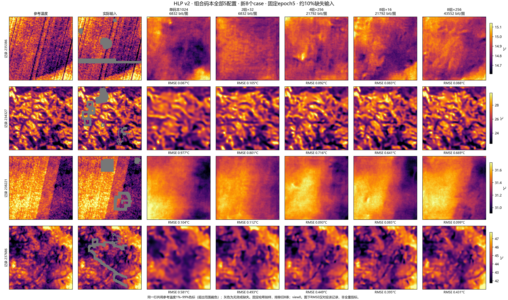

# 组合码本实验总览：A06＋A07全部5配置与新8个case

汇总日期：2026-10-02。范围为本线程已完成的组合码本对照线：A06 single1024、g2k32、g4k256，A07 g8k16、g8k256，共5个唯一模型、20个完整评估单元。single1024作为单码本基线一并列出；A07复用的g4结果不重复计数。

## 结论

在已测配置中，g2k32是6832 bit/图档位的较优方案；g8k16是21792 bit/图档位的较优方案。g8k256取得最低全量总体RMSE，但索引位数再翻倍，仅带来约0.5%的test误差下降。若重视当前误差与位数的权衡，g8k16更值得保留为后续基线。所有结论仅限seed17，未证明多种子稳定优越性。

## 统一条件与表示预算

五模型均仅输入LST与mask，32维潜在表示、680个多尺度位置，选码后拼接再使用全通道Phi；可见均温残差预测＋空间误差4倍。HLP v2固定train218975/val11684/test11757，新train归一化和同A05 split-local QA库；没有HLS或Prithvi模型参与。每模型从零5完整epoch，17110更新、1094875条记录呈现，有效batch64、尾31实际加权。固定epoch5 last.pt，每轮完整val，最终每条件两个视图；未以test选模。

| 实验 | 配置 | 组数×K | 组内维数 | 码本参数 | bit/位置 | bit/图含均温 | 相对基线位数 |
|---|---|---:|---:|---:|---:|---:|---:|
| A06 | single1024 | 1×1024 | 32 | 32768 | 10 | 6832 | 1.000× |
| A06 | g2k32 | 2×32 | 16 | 1024 | 10 | 6832 | 1.000× |
| A06 | g4k256 | 4×256 | 8 | 8192 | 32 | 21792 | 3.190× |
| A07 | g8k16 | 8×16 | 4 | 512 | 32 | 21792 | 3.190× |
| A07 | g8k256 | 8×256 | 4 | 8192 | 64 | 43552 | 6.375× |

bit/图为固定索引加32bit可见均温；不含mask、模型、文件头，非实际熵编码文件大小。独立分组码字的笛卡尔积不是实际使用的联合码字数。g2与single同码率，g8k16与g4同码率；其余比较不能称同码率。

## 全量总体RMSE（°C，越低越好）

| 配置 | val clean | val noisy10 | test clean | test noisy10 |
|---|---:|---:|---:|---:|
| single1024 | 0.991109 | 1.029323 | 0.948149 | 0.985072 |
| g2k32 | 0.842245 | 0.899972 | 0.805381 | 0.861624 |
| g4k256 | 0.721461 | 0.787929 | 0.693595 | 0.757358 |
| g8k16 | 0.651494 | 0.727901 | 0.625777 | 0.699742 |
| g8k256 | 0.644670 | 0.721231 | 0.623212 | 0.696104 |

## 同码率收益与扩容量收益

| 比较（新←旧） | 位数关系 | test clean RMSE降低 | test noisy10 RMSE降低 | noisy10缺失区RMSE降低 |
|---|---|---:|---:|---:|
| g2k32 ← single1024 | 同码率 | 15.06% | 12.53% | 3.82% |
| g4k256 ← g2k32 | 总位数3.19倍 | 13.88% | 12.10% | 4.46% |
| g8k16 ← g4k256 | 同码率 | 9.78% | 7.61% | 1.56% |
| g8k256 ← g8k16 | 索引位数2倍 | 0.41% | 0.52% | 0.50% |

同码率分组改善总体误差，但缺失区改善明显更小。模型骨干保持一致，组数、每组维数和字典大小同时改变，不能将收益解释为纯组数的独立因果效应。

## 全量误差分解

单位°C。总体、均值、空间、梯度、缺失和保留误差均覆盖完整集合；clean无人工缺失区，记—。先记录内平均视图MSE，再记录等权平均开方。总体MSE=均值MSE+空间MSE；各区域独立归一，不能用一个全局缺失比例直接拼回总体RMSE。

| 集合 | 条件 | 配置 | 总体 | 均值 | 空间 | 梯度 | 缺失区 | 保留区 |
|---|---|---|---:|---:|---:|---:|---:|---:|
| val | clean | single1024 | 0.991109 | 0.039479 | 0.990322 | 0.348229 | — | 0.991109 |
| val | clean | g2k32 | 0.842245 | 0.043132 | 0.841140 | 0.329126 | — | 0.842245 |
| val | clean | g4k256 | 0.721461 | 0.042381 | 0.720215 | 0.311980 | — | 0.721461 |
| val | clean | g8k16 | 0.651494 | 0.051487 | 0.649456 | 0.301265 | — | 0.651494 |
| val | clean | g8k256 | 0.644670 | 0.030004 | 0.643972 | 0.297942 | — | 0.644670 |
| val | noisy10 | single1024 | 1.029323 | 0.114662 | 1.022917 | 0.350590 | 1.379755 | 0.983295 |
| val | noisy10 | g2k32 | 0.899972 | 0.092942 | 0.895160 | 0.333021 | 1.327624 | 0.839889 |
| val | noisy10 | g4k256 | 0.787929 | 0.050035 | 0.786338 | 0.317027 | 1.266376 | 0.716226 |
| val | noisy10 | g8k16 | 0.727901 | 0.053047 | 0.725965 | 0.306974 | 1.245283 | 0.646386 |
| val | noisy10 | g8k256 | 0.721231 | 0.053371 | 0.719254 | 0.304263 | 1.238061 | 0.639575 |
| test | clean | single1024 | 0.948149 | 0.038192 | 0.947380 | 0.341939 | — | 0.948149 |
| test | clean | g2k32 | 0.805381 | 0.040948 | 0.804339 | 0.324503 | — | 0.805381 |
| test | clean | g4k256 | 0.693595 | 0.043718 | 0.692216 | 0.309247 | — | 0.693595 |
| test | clean | g8k16 | 0.625777 | 0.049666 | 0.623803 | 0.299450 | — | 0.625777 |
| test | clean | g8k256 | 0.623212 | 0.031760 | 0.622402 | 0.296943 | — | 0.623212 |
| test | noisy10 | single1024 | 0.985072 | 0.108578 | 0.979070 | 0.344202 | 1.323494 | 0.940556 |
| test | noisy10 | g2k32 | 0.861624 | 0.089373 | 0.856977 | 0.328132 | 1.272973 | 0.803774 |
| test | noisy10 | g4k256 | 0.757358 | 0.048930 | 0.755775 | 0.313983 | 1.216145 | 0.688656 |
| test | noisy10 | g8k16 | 0.699742 | 0.050319 | 0.697931 | 0.304754 | 1.197153 | 0.621381 |
| test | noisy10 | g8k256 | 0.696104 | 0.053245 | 0.694065 | 0.302770 | 1.191169 | 0.618099 |

## 码字使用与稳定性

下面为test noisy10逐组数据，组编号从0开始。top1/top10和困惑度跨尺度汇总；图内指标为最细16×16尺度。频数覆盖所有传输位置，包含参考无效区。翻转仅有按组跨尺度汇总，不能推断逐尺度翻转率。不同组同编号不是同一码字，单组困惑度不是联合容量。

| 配置 | 组 | 使用/K | 困惑度 | top1 | top10 | 图内独有码字 | 图内熵bit | 相邻变化 | 参考区翻转 | 共同可见区翻转 |
|---|---:|---:|---:|---:|---:|---:|---:|---:|---:|---:|
| single1024 | 0 | 885/1024 | 9.263 | 17.82% | 99.0622% | 14.272 | 3.229 | 89.00% | 49.96% | 48.03% |
| g2k32 | 0 | 31/32 | 6.024 | 26.85% | 99.0195% | 10.461 | 2.767 | 82.95% | 45.62% | 44.36% |
| g2k32 | 1 | 32/32 | 5.878 | 27.52% | 99.8991% | 7.187 | 2.571 | 83.05% | 47.55% | 46.10% |
| g4k256 | 0 | 152/256 | 3.127 | 39.59% | 99.8598% | 5.207 | 1.687 | 69.63% | 34.68% | 33.44% |
| g4k256 | 1 | 163/256 | 2.943 | 61.70% | 99.8503% | 5.880 | 1.790 | 65.73% | 25.63% | 24.72% |
| g4k256 | 2 | 149/256 | 1.920 | 84.73% | 99.9317% | 6.158 | 1.328 | 43.46% | 8.08% | 7.51% |
| g4k256 | 3 | 157/256 | 3.855 | 33.78% | 99.8527% | 5.953 | 1.990 | 74.87% | 36.84% | 35.55% |
| g8k16 | 0 | 16/16 | 2.286 | 56.51% | 99.9981% | 3.085 | 1.289 | 59.40% | 26.33% | 25.45% |
| g8k16 | 1 | 16/16 | 3.038 | 34.97% | 99.9976% | 3.490 | 1.607 | 69.79% | 37.48% | 36.28% |
| g8k16 | 2 | 16/16 | 2.349 | 55.48% | 99.9991% | 3.162 | 1.320 | 60.44% | 28.07% | 27.12% |
| g8k16 | 3 | 15/16 | 2.064 | 69.29% | 99.9992% | 3.207 | 1.212 | 53.65% | 21.20% | 20.54% |
| g8k16 | 4 | 16/16 | 3.005 | 40.58% | 99.9965% | 3.505 | 1.601 | 69.19% | 35.85% | 34.62% |
| g8k16 | 5 | 16/16 | 1.971 | 73.84% | 99.9955% | 3.574 | 1.194 | 52.61% | 16.10% | 15.59% |
| g8k16 | 6 | 14/16 | 2.319 | 53.20% | 99.9996% | 3.556 | 1.335 | 59.37% | 27.92% | 26.70% |
| g8k16 | 7 | 13/16 | 1.441 | 89.70% | 99.9998% | 2.903 | 0.705 | 30.44% | 5.40% | 5.07% |
| g8k256 | 0 | 102/256 | 1.446 | 91.65% | 99.9455% | 4.266 | 0.827 | 30.35% | 4.01% | 3.61% |
| g8k256 | 1 | 118/256 | 1.536 | 91.86% | 99.7947% | 6.964 | 1.031 | 30.99% | 3.76% | 3.32% |
| g8k256 | 2 | 100/256 | 2.068 | 76.13% | 99.9550% | 4.276 | 1.289 | 53.56% | 12.52% | 11.70% |
| g8k256 | 3 | 100/256 | 2.183 | 51.48% | 99.8425% | 5.093 | 1.209 | 54.88% | 25.62% | 24.70% |
| g8k256 | 4 | 128/256 | 2.981 | 42.45% | 99.8637% | 5.209 | 1.697 | 67.37% | 30.58% | 29.26% |
| g8k256 | 5 | 93/256 | 2.128 | 54.65% | 99.8530% | 4.571 | 1.159 | 55.44% | 24.11% | 23.07% |
| g8k256 | 6 | 108/256 | 2.219 | 59.69% | 99.8602% | 4.896 | 1.292 | 57.84% | 23.06% | 22.00% |
| g8k256 | 7 | 102/256 | 1.353 | 94.06% | 99.8796% | 4.936 | 0.728 | 24.25% | 2.84% | 2.50% |

用过许多码字不等于使用均匀；低翻转可能伴随强top1集中。token变化和高熵都不能单独证明细节恢复正确。完整val/test逐组逐尺度统计与原始频数见下列原始报告附录：
- [A06全部3配置统计](../lst_grouped_vq_20260924/CODEBOOK_DETAILS_ZH.md)
- [A07两配置及g4参考统计](../lst_grouped_vq8_20260928/CODEBOOK_DETAILS_ZH.md)

## 新8个case：五配置同图比较

按(SHA256("grouped-vq-case-20261002:"＋记录ID), 记录ID)排序取前8条，排除旧8条，未依据图像或模型误差筛选；只改变展示抽样，没有修改数据划分。记录：240455、235502、236343、233332、235386、234327、238221、237686。

展示view0。每一行所有模型和输入共用参考图1%–99%色标，超出范围截色；灰色为参考无效/输入缺失。图下RMSE是该记录view0的全有效区误差，不是缺失区误差或全量均值。输入与checkpoint哈希核对通过，80个模型×条件×记录的MSE与原全量评估对齐。

### 干净输入，第1–4条

### 干净输入，第5–8条

### 约10%缺失输入，第1–4条

### 约10%缺失输入，第5–8条

四张PNG均已逐张实际打开检查，标签、统一色标和单图RMSE可读。第1页的240455、235502、233332显示分组模型在一些局部冷热结构上改善；236343干净输入的河道轮廓更清楚，但遮挡河道后所有模型都未能正确连接。第2页的235386和238221温差很小，绝对RMSE低，但细碎纹理与条带仍被抹平；低RMSE不等于这些结构已恢复。234327和237686仍存在纹理平滑和缺失区域形状偏差。

这8条样例中g8k16经常优于g8k256，与全量g8k256略优不矛盾：小样本的局部排名不能替代全量结果。样例规则固定且保留，不能再因排名不符合预期而重选。

## 训练与评估用时

两次实验分别使用同一块GPU上的作业活动区间并集，包含训练期val与存盘，非CUDA内核计时；故障结束时刻未知时保留上下界，确定停机排除。各模型墙钟不可相加当GPU-hours，也不可据并行墙钟直接判断模型速度。

| 实验 | 训练GPU活动并集(h) | 最终评估(h) | 技术检查(h) |
|---|---:|---:|---:|
| A06 | 39.706–39.751 | 1.452 | 0.050 |
| A07 | 28.683–29.911 | 1.212 | 0.026 |

| 配置 | 训练作业活动墙钟下界–上界(h) |
|---|---:|
| single1024 | 14.301–14.301 |
| g2k32 | 25.405–25.449 |
| g4k256 | 27.711–27.756 |
| g8k16 | 28.681–29.909 |
| g8k256 | 28.683–29.911 |

本次仅加载已有epoch5权重做8记录推理与绘图，额外墙钟19.824秒（包括CPU绘图和IO）。未新增训练或改变原始评估分数。历史绘图用时仍保留在各原报告中，不混入训练。

## 证据与限制

- [A06原始报告](../lst_grouped_vq_20260924/REPORT_ZH.md)；[A07原始报告](../lst_grouped_vq8_20260928/REPORT_ZH.md)。
- [20单元指标及来源哈希](comparison_results.json)、[新case选择规则](selection.json)、[80项预测对齐核验](gallery/review.json)、[本次汇总审查](review.json)。
- 五配置具有相同评估成员、双视图输入摘要和数据指纹；全量样本与token文件哈希和总体MSE分解通过复核。原训练门禁保留，均为精确5轮共同样本流。
- 单种子17，历史test查看记录保留；不将test用于新方案选择。tile ID隔离不等于已核验地理footprint零重叠。fine LST为卫星反演参考产品。
- 本汇总覆盖组合码本线A06/A07及单码本基线；没有把旧数据/旧预算的A02–A05或Prithvi AE混入同条件排名。
